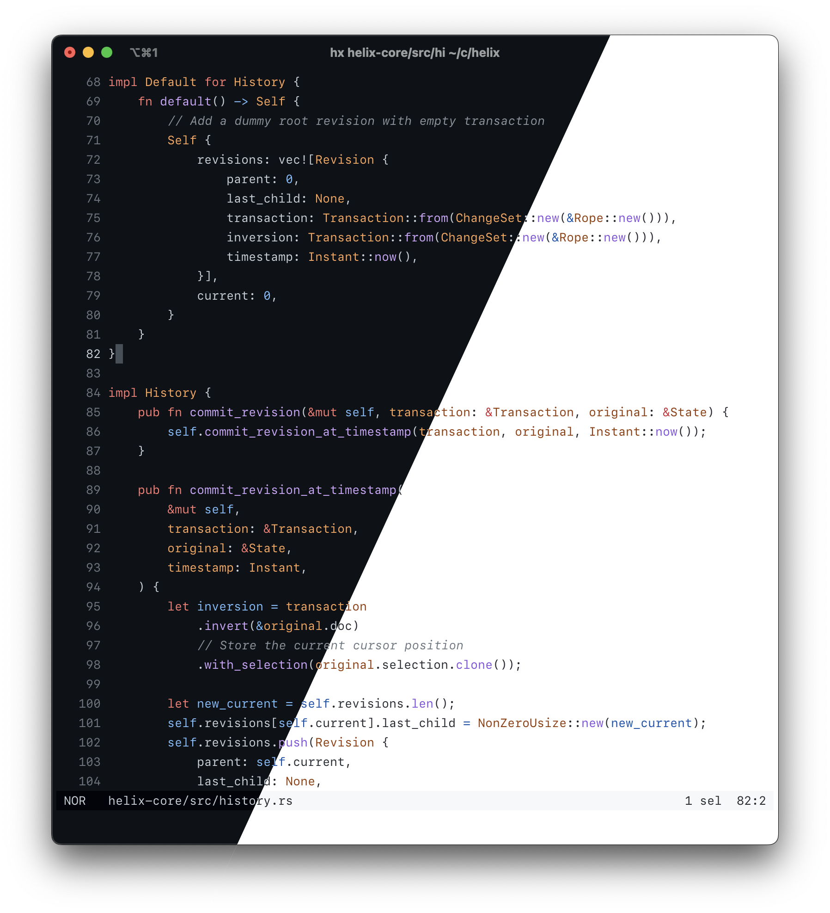

<div align="center">
  
</div>

# Github themes for [Helix](https://helix-editor.com/) text editor

Adapted from [primer/github-vscode-theme](https://github.com/primer/github-vscode-theme)

## Available variants

- `github_dark`
- `github_dark_colorblind`
- `github_dark_dimmed`
- `github_dark_high_contrast`
- `github_light`
- `github_light_colorblind`
- `github_light_high_contrast`

## Installation

Copy files from `./themes` to the `themes` in your helix config directory – usually `~/.config/helix/themes` (see [docs](https://docs.helix-editor.com/themes.html)).

```sh
cp ./themes/*.toml ~/.config/helix/themes
```

…or use `make install`, which will do the same:

```sh
make install
```
